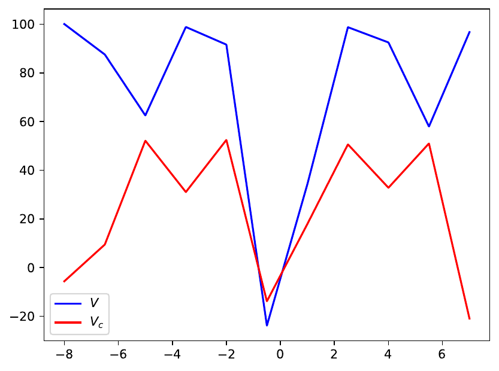
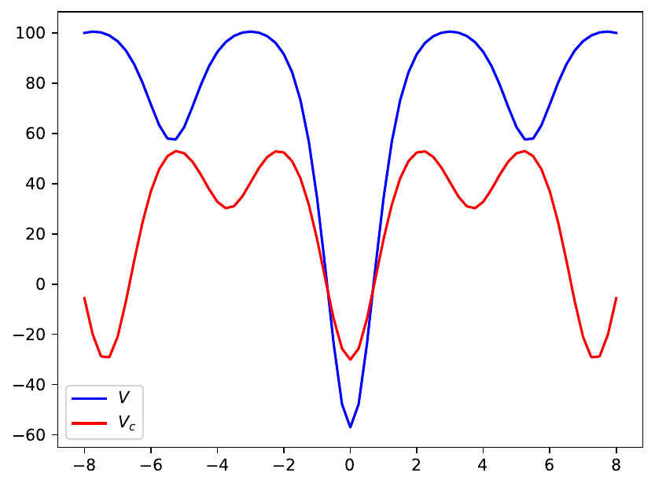

# $^{135}$Pr - Energy Ellipsoid and Energy Surface

Study of the energy surface for the $^{135}$Pr isotope using a semi-classical approximation for the energy function H'.

The energy surface is graphically represented, together with the triaxial potential and the *energy ellipsoid* given by the 3-dimensional representation of the nucleus in the total angular momentum space.

## Project goal

[ ] - Create *Contour Plots*  for the three cases of quantization:

* Short axis quantization
* Long axis quantization
* Intermediate axis quantization

[ ] - Compute the inertial factor $A$ for every situation of inertial moments ordering.

[ ] - Plot the *triaxial potential* $V(q)$ for  the required inertial parameters and the elliptical coordinate $q$.

[ ] - Compute and represent the 3D surface of the nucleus's energy, taking into consideration the values of the moments of inertia and the *coupling angle* $\theta$.

## Revised work

### July 2020 - JPG preparation

For [Journal of Physics G](https://iopscience.iop.org/journal/0954-3899), a revised and overall **improved** version of the paper must be submitted.

The tasks required for improving the results are related to the inertial parameter. One must redo the contour plots with new parameters.

### Fixing inconsistency between Py3 and Math

The Python3 and Mathematica implementations had issues with obtaining consistent results for the potential tuple ($V(q)$ and $V'(q)$).

By fixing the total spin $I$ and the single particle's angular momentum $j$, one can obtain the numerical values for the potentials after the _parameter set_ is also numerically fixed. The inertial parameters $A, v_0,u,k$ are computed at a value of the coupling angle $\theta$, but also $\theta'=\theta+\pi$.

The main issue which occurs when the algorithms are computing the values of the potential is related to the ordering of the moments of inertia.

More precisely, in the term $u$ and $k$ (where $k=\sqrt{u}$), the sign of $u$ is given by the difference between the first and the third moments of inertia. If the difference $A_3-A_1$ is negative, then the inertial parameter $k$ will be a complex number. In order to fix this, for this special case, the quantity $k$ will be fixed $k=\sqrt{|u|}$ in both implementations.

See [this commit](https://github.com/basavyr/Pr135_energyEllipsoid/commit/bb672e73e7fad1fbb27ae9044ccc503179bbceb1) for the actual solution implemented.

### Potential *quality*

The quality of the plot depends on the number of $\theta$ values at which the potential tuple $(V,V')$ is evaluated. Higher number of *evaluation points* will consist in a smoother potential curve. Below there is an example of a plot with low number of eval. points and a high number of eval. points.

___
*Low eval points plot.*

___
*High eval points plot.*
